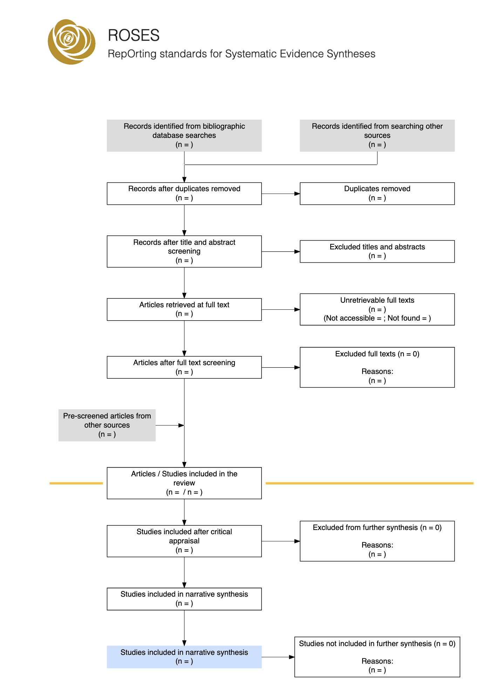
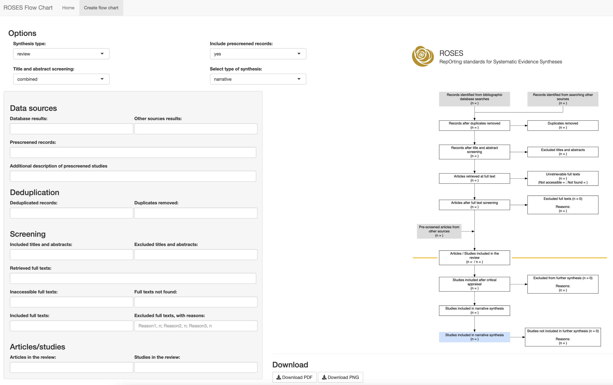

# ROSES Flow Chart 

You can use this package to produce a flow chart that conforms to the ROSES reporting standards for systematic reviews and maps. The data can be manually entered into the function, or loaded up using the template CSV file provided in 'INST/EXTDATA/'. The function, (if 'interactive = TRUE') produces an interactive HTML ouput with each box linking to a specific page (e.g. of search results or methods details), and hover-over tooltips for further information. 
 

 

You can access the free, interactive Shiny app <a href="https://estech.shinyapps.io/roses_flowchart/" target="_blank">here. 
</a>
